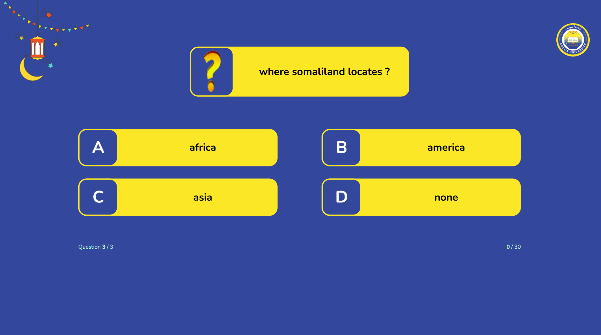

# Tournament Management System

A web application for managing faculty challenges and tournaments with real-time updates and user authentication.



## Features

- **User Authentication**  
  Integrated Clerk for secure user authentication and session management.

- **Challenge Management**  
  - CRUD operations for challenges
  - Dedicated "New Challenge" page
  - Challenge schema with MongoDB integration
  - Server actions for challenge state management

- **Tournament UI**  
  - Dark theme interface
  - Responsive navigation with styled icons
  - Real-time status updates for faculty tournaments
  - Loading spinners during data streaming (Suspense integration)

- **State Persistence**  
  - Auto-save/load question states using localStorage
  - Server-side major/faculty status management

- **Additional Components**  
  - Pick-a-number game component
  - Custom timer component
  - User profile button from Clerk
  - Error handling and input validation

## Tech Stack

- **Frontend**: Next.js, TypeScript
- **Backend**: Next.js API routes, Server Actions
- **Database**: MongoDB (with Mongoose)
- **Authentication**: Clerk
- **State Management**: localStorage, Suspense
- **Styling**: Tailwind CSS , Dasiy UI

## Installation

1. Clone the repository
   ```bash
   git clone https://github.com/naru70o/tournament-system.git

